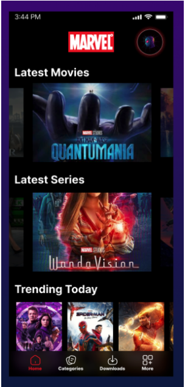

# Movie Database Application
This project is assessment from PT eDOT. The requirement is have few prerequisite:

## Prerequisite
1. Create layout like picture below with standard design using xml kotlin
   
2. Create Structure code using MVVM
3. Integration with API
   `https://movie-database-alternative.p.rapidapi.com/?s=Avengers%20Endgame&r=json&page=1

   val client = OkHttpClient()
   val request = Request.Builder().url("https://movie-database-alternative.p.rapidapi.com/?s=Avengers%20Endgame&r=json&page=1")
   .get()
   .addHeader("X-RapidAPI-Key","fb95ae1931msh2ac097db24eea93p104451jsn2093040cdc91")
   .addHeader("X-RapidAPI-Host", "movie-database-alternative.p.rapidapi.com")
   .build()
   val response = client.newCall(request).execute()
   `
4. Create layout picture with slider

## Overview
